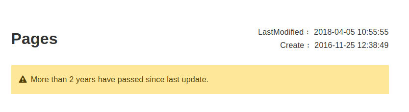

# honkit-plugin-page-freshness



## book.json

```js
{
    "plugins": ["page-freshness"]
    "pluginsConfig": {
        "page-freshness":{
            "position": "top",
            "modifyTpl": "Last modified by {user} {timeStamp}",
            "createTpl": "Created by {user} {timeStamp}",
            "timeStampFormat": "YYYY-MM-DD HH:mm:ss",
            "bestBeforeUnit":"days",
            "bestBefore":"180",
            "noticeTpl":"More than {passed} days have passed since last update."
        }
    }
}
```